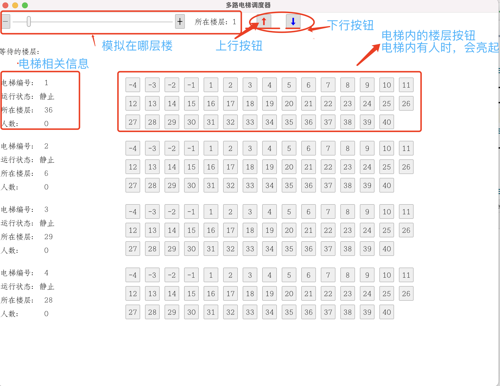

## 多电梯调度程序
* 项目使用基于 [iced] 和 [tokio] 开发的

## 说明
 
## 运行截图
 

## 运行方法
* 直接在本项目所在的路径执行命令 `cargo run`

## 依赖
满足[iced]支持的最小的[rust]版本即可

[tokio]: https://tokio.rs/
[rust]: https://www.rust-lang.org/
[iced]: https://docs.rs/iced/0.3.0/iced/widget/index.html

